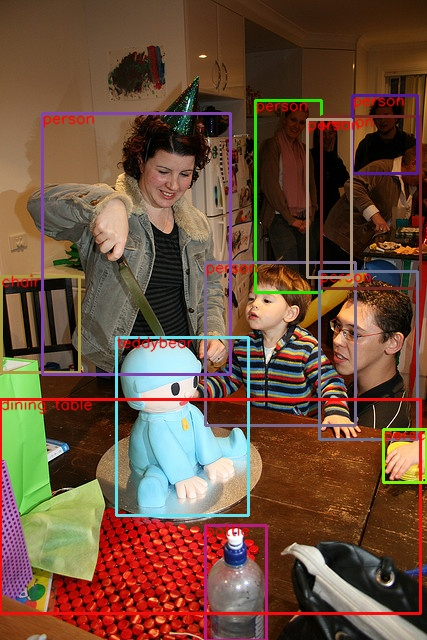
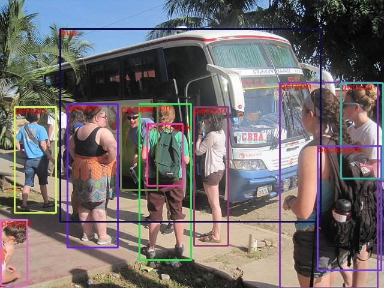

# Faster-RCNN-with-torchvision
通过pytorch torchvision官方提供的模块构建Faster-RCNN，可供代码学习和实际使用
代码博客解析地址：[csdn](https://blog.csdn.net/watermelon1123/article/details/99570700)
模型地址：[baidu cloud](https://pan.baidu.com/s/17Kpg01ukezrhHJ8vnG8K7A)

## 安装
##### 代码及环境搭建
    $ git clone https://github.com/supernotman/Faster-RCNN-with-torchvision.git
    $ cd Faster-RCNN-with-torchvision/
    $ sudo pip install -r requirements.txt

##### 数据准备
目前代码仅支持coco数据集的训练
1. 下载coco2017数据集

2. 下载后数据集文件结构如下：

```Shell
  coco/
    2017/
      annotations/
      test2017/
      train2017/
      val2017/
```

## 训练
##### 命令
```
python -m torch.distributed.launch --nproc_per_node=6 --use_env train.py --world-size 6 --b 4
```

##### 参数说明
[--nproc_per_node]   训练占用gpu数目
[--b]                每个gpu上batch_size大小
[--epochs]           训练epoch数目
[output-dir]         模型输出路径


## 单张图片检测
```
$ python detect.py --model_path result/model_13.pth --image_path imgs/1.jpg
```

## 结果

##### 准确率
 Average Precision  (AP) @[ IoU=0.50:0.95 | area=   all | maxDets=100 ] = 0.352
 Average Precision  (AP) @[ IoU=0.50      | area=   all | maxDets=100 ] = 0.573
 Average Precision  (AP) @[ IoU=0.75      | area=   all | maxDets=100 ] = 0.375
 Average Precision  (AP) @[ IoU=0.50:0.95 | area= small | maxDets=100 ] = 0.207
 Average Precision  (AP) @[ IoU=0.50:0.95 | area=medium | maxDets=100 ] = 0.387
 Average Precision  (AP) @[ IoU=0.50:0.95 | area= large | maxDets=100 ] = 0.448
 Average Recall     (AR) @[ IoU=0.50:0.95 | area=   all | maxDets=  1 ] = 0.296
 Average Recall     (AR) @[ IoU=0.50:0.95 | area=   all | maxDets= 10 ] = 0.474
 Average Recall     (AR) @[ IoU=0.50:0.95 | area=   all | maxDets=100 ] = 0.498
 Average Recall     (AR) @[ IoU=0.50:0.95 | area= small | maxDets=100 ] = 0.312
 Average Recall     (AR) @[ IoU=0.50:0.95 | area=medium | maxDets=100 ] = 0.538
 Average Recall     (AR) @[ IoU=0.50:0.95 | area= large | maxDets=100 ] = 0.631

##### 结果示例
<p align="center"></p>
<p align="center"></p>